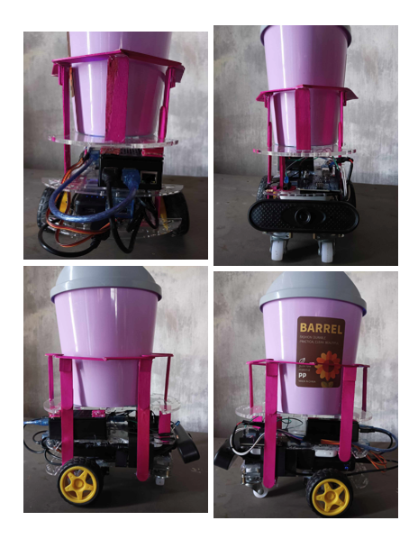

# Dolly: A Voice-Activated And Gesture-Recognizing Smart Trashcan Utilizing The YOLO Algorithm For Autonomous Navigation

# Overview

DOLLY is a smart trashcan designed to improve waste disposal accessibility by integrating voice activation and gesture recognition. The system utilizes the YOLO (You Only Look Once) algorithm for real-time object detection, enabling it to recognize a 'thumbs-up' gesture and navigate autonomously towards the user. This project aims to assist individuals with mobility impairments and enhance waste management efficiency.

# Features

* Wake Word Detection: Uses Porcupine Wake Word Engine to activate the system with the phrase "Hey Dolly."
* Gesture Recognition: Implements YOLOv8 for detecting 'thumbs-up' gestures to initiate movement towards the user.
* Autonomous Navigation: Utilizes an ultrasonic sensor to detect obstacles and stop within a safe distance for trash disposal.
* Servo Motor Control: Controlled via an Arduino Uno for smooth movement and precise navigation.
* LED Indicators: Visual feedback for different system states (wake word detected, scanning, movement, and stop).

# Hardware Components

- Raspberry Pi 4 Model B - Runs YOLOv8 for real-time object detection.
- USB Webcam - Captures live video for gesture recognition.
- Arduino Uno - Controls motor movements based on Raspberry Pi commands.
- MG995 Servo Motors - Continuous rotation servos for wheel movement.
- HC-SR04 Ultrasonic Sensor - Measures distance to obstacles.
- LED Module - Provides system status indications.

# Software Requirements

- Operating System: Raspberry Pi OS
- Programming Languages:
    - Python: main program
    - C++: Aurduino Uno program
- Libraries & Dependencies:
    - ultralytics (YOLOv8)
    - pyaudio (for wake word detection)
    - pvporcupine (Porcupine Wake Word Engine)
    - opencv-python (for video processing)
    - serial (for Arduino communication)
    - RPi.GPIO (for ultrasonic sensor integration on Raspberry Pi)

# System Workflow

1. Wake Word Activation: Dolly remains in standby mode, waiting for the phrase "Hey Dolly."
2. Object Detection: Upon activation, Dolly starts scanning for a 'thumbs-up' gesture.
3. Navigation: If a 'thumbs-up' is detected and the user is beyond 50 cm, Dolly moves forward.
4. Stopping Mechanism: If the ultrasonic sensor does not detect thumbs-up or detects a distance below 50 cm, Dolly stops, allowing the user to dispose of trash.

# Model Training

- Dataset: 1,699 images collected and annotated using Roboflow.
- Training Configuration:
    - Framework: Ultralytics YOLOv8
    - Learning Rate: 0.01
    - Image Size: 640x640
    - Epochs: 100

# Model Performance

- Mean Average Precision (mAP): 95%
- Accuracy rate: 94%
- Recall: 94%
- Inference Time: 600-800ms per frame (on Raspberry Pi 4 Model B)

Researchers:
- Arnold Rie J. Sejera
- John Mark C. Ruam
- *Gerald M. Carique

# License
This project is licensed under the MIT License. See the LICENSE file for details.

 

